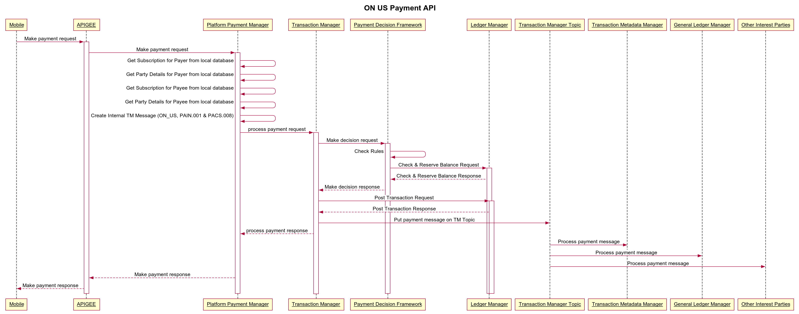
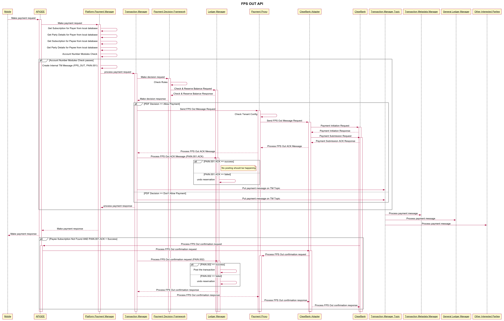

= Transaction Manager - On Call Runbook - 1.8
:toc:

== Transaction Manager Component

Transaction manager coordinates transaction with participating services. Only Fps Out transaction and On Us transaction functions are deployed as part of R1.8.

ON US payment is a payment type where both payer and payee are customers of 10x tenant. In this case, there won't be any communication to scheme(s) to make the payment. This is all internal payment and money is transferred in between payer's subscription and payee's subscriptions. Both subscriptions need to exist and active in order to make ON US payment. See the diagram below for ON US payment.

FPS OUT payment is a payment type where payer is a customer of 10x tenant and payee is not. Payer's subscription needs to exist and active in order to make FPS OUT payment. Once the subscription is found and active, payment is sent out to scheme via payment scheme provider. Only ClearBank is integrated for R1.8.

Here is the list of the dependencies of the component:

|===
| Dependency Type | Resource Type | Name | Notes | URL

| Upstream | Microservice | platform-payment-manager | Send platform initiated payments | https://platformpaymentmanager-corepayments.svc.{ENVIRONMENT}.mylti3gh7p4x.net/health
| Downstream | Microservice | payment-decision-framework | Calling payment decision endpoint on this component to make payment decision | https://paymentdecisionframework-corepayments.svc.{ENVIRONMENT}.mylti3gh7p4x.net/health
| Downstream | Microservice | payment-proxy | Calling process payment proxy endpoint on this component to process payment transactions | https://paymentproxy-corepayments.svc.{ENVIRONMENT}.mylti3gh7p4x.net/health
| Downstream | Microservice | ledger-manager | Calling process ledger manager endpoint on this component to process payment transactions | https://ledgermanager-corebanking.svc.{ENVIRONMENT}.mylti3gh7p4x.net/health
| Downstream | Kafka Topic | payment-messages-topic | Posting transaction messages events on this topic  | https://kafkacontrolcenter-analytics.svc.{ENVIRONMENT}.mylti3gh7p4x.net/management/clusters/lkc-l7y32/topics/
|===

Here is the list of the database tables of the component:

|===
| Table Name | Description
|===

==== Application logs
|===
| Environment | Application logs

| STB  | https://service.eu.sumologic.com/ui
|===

== Troubleshooting and debugging

|===
| Scenario | FPS Out API is returned successful, posted balance hasn't been reflected although available balance is reflected
| Flow | FPS Out
| Potential Reason | This might not be problem. FPS Out flow is not fully sync flow. Wel, from 10x side, initiate the payment request and send it to payment scheme provider. They return "ACK" and then continue to process async. Posted balance is updated after async message is received from payment scheme provider. This normally takes around 2-3 seconds, however it may take longer in case of Fraud & AML checks by provider.
| Potential Solution | Check the logs in ClearBank Adapter and other components in the chain (see sequence diagram above). If there is no exception, you should just wait to receive async message. If it takes a lot longer, logs need to be investigated fully.
|===

|===
| Scenario | FPS Out API is returned an error, although posted balance is correct, money has been deducted from available balance as if it was successful
| Flow | FPS Out
| Potential Reason | This means an internal exception occured after reserving the balance and system couldn't undo reserve during FPS Out message. Normally, this should be handled by internal reconcilliation manager although it is not ready yet.
| Potential Solution | Check the logs and see the exception. Report the issue to FT1 together with the details. Balance needs to be unreserved for customers to use their money.
|===

|===
| Scenario | Payer party not found error returned by API
| Flow | FPS Out
| Potential Reason | party-event-v3 topic is consumed by platform payment manager component and all party data are stored in customer_event_view or business_customer_event_view table in database. If API returns this error, it means party details does not exist in the local table(s). Either party manager cannot produce to topic or platform payment manager manager consume from the topic. Another reason might be record cannot be inserted into table for various reasons.
| Potential Solution | Check if party-event-v3 topic is up and accepting data. Then if check party manager is up and running. If so, report the problem to FT2 and they can check if they can produce data to kafka topic or not.
|===

|===
| Scenario | Payer party not found error returned by API
| Flow | On Us
| Potential Reason | party-event-v3 topic is consumed by platform payment manager component and all party data are stored in customer_event_view or business_customer_event_view table in database. If API returns this error, it means party details does not exist in the local table(s). Either party manager cannot produce to topic or platform payment manager manager consume from the topic. Another reason might be record cannot be inserted into table for various reasons.
| Potential Solution | Check if party-event-v3 topic is up and accepting data. Then if check party manager is up and running. If so, report the problem to FT2 and they can check if they can produce data to kafka topic or not.
|===

|===
| Scenario | Payee party not found error returned by API
| Flow | On Us
| Potential Reason | party-event-v3 topic is consumed by platform payment manager component and all party data are stored in customer_event_view or business_customer_event_view table in database. If API returns this error, it means party details does not exist in the local table(s). Either party manager cannot produce to topic or platform payment manager manager consume from the topic. Another reason might be record cannot be inserted into table for various reasons.
| Potential Solution | Check if party-event-v3 topic is up and accepting data. Then if check party manager is up and running. If so, report the problem to FT2 and they can check if they can produce data to kafka topic or not.
|===

|===
| Scenario | Payer subscription not found error returned by API
| Flow | On Us
| Potential Reason | subscription-event-v2 topic is consumed by platform payment manager component and all subscriptions are stored in subscriptions table in database. If API returns this error, it means subscription does not exist in the subscription table. Either subscription manager cannot produce to topic or platform payment manager manager consume from the topic. Another reason might be record cannot be inserted into table for various reasons.
| Potential Solution | Check if subscription-event-v2 topic is up and accepting data. Then if check subscription manager is up and running. If so, report the problem to FT3 and they can check if they can produce data to kafka topic or not.
|===

|===
| Scenario | Payer subscription not found error returned by API
| Flow | FPS Out
| Potential Reason | subscription-event-v2 topic is consumed by platform payment manager component and all subscriptions are stored in subscriptions table in database. If API returns this error, it means subscription does not exist in the subscription table. Either subscription manager cannot produce to topic or platform payment manager manager consume from the topic. Another reason might be record cannot be inserted into table for various reasons.
| Potential Solution | Check if subscription-event-v2 topic is up and accepting data. Then if check subscription manager is up and running. If so, report the problem to FT3 and they can check if they can produce data to kafka topic or not.
|===

|===
| Scenario | Payee subscription not found error returned by API
| Flow | On Us
| Potential Reason | subscription-event-v2 topic is consumed by platform payment manager component and all subscriptions are stored in subscriptions table in database. If API returns this error, it means subscription does not exist in the subscription table. Either subscription manager cannot produce to topic or platform payment manager manager consume from the topic. Another reason might be record cannot be inserted into table for various reasons.
| Potential Solution | Check if subscription-event-v2 topic is up and accepting data. Then if check subscription manager is up and running. If so, report the problem to FT3 and they can check if they can produce data to kafka topic or not.
|===
